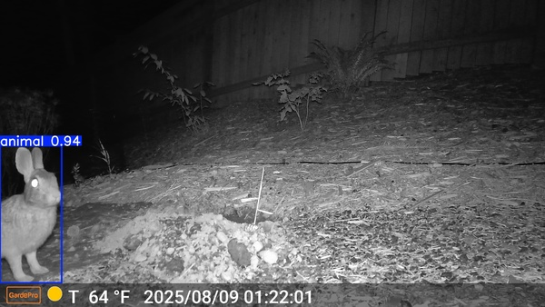

Given:

- frame.work AMD Ryzen 7 7840U
- A bunch of images from a trail cam

The procedure in this repository filters the images and draws bounding boxes. It
uses GPU acceleration under the hood, improving the speed.

# Sample output



# Caveats

The frame.work uses an APU, so the RAM is shared between the system and the
GPU. During the runs I have had many desktop environment crashes. Treat this
code as unstable and save all your work in advance.

The base container image comes in at hefty 30GB.

Code is bare-bones and tuned to this use case. I spent way too much time
fighting the APU and the drivers to care any more about this. Caveat emptor.
Nullus refundus.

# Usage

1. Ensure that your system allocated 4GB to GPU (set "gaming" mode in BIOS). You
   can check the actual value by running, say, `amd_gpu_top` and looking at the
   VRAM value.
2. This step is potentially necessary. It has improved stability in my
   experiments. Add this to the kernel command line:

   ```
      "amdgpu.mes=0" # Disable the Micro Engine Scheduler
      "amdgpu.vm_update_mode=3" # Force VM updates to CPU to improve recovery success
      "amdgpu.gpu_recovery=1" # Ensure the driver explicitly attempts recovery on hang
      "amdgpu.dcdebugmask=0x10" # Optional: Disable Panel Self Refresh (Prevents DE flickers/hangs)
   ```

3. Set up `podman`
4. Clone this repository
5. Run `podman build -t my-rocm-image-with-ultralytics:latest .`
6. Prepare image files. The general expectation of the procedure is that the files are: 

    - In `./src-images` directory
    - Directory should be relative to the repo
    - Have `.jpg` extension
    - There are no duplicate files
7. Download a model from [`agentmorris/MegaDetector`][1]. I used the "sorrel"
   one. The model filename should be `model.pt` and it should be saved in the
   same directory.

   For example:

   ```
   curl -L -o model.pt https://github.com/agentmorris/MegaDetector/releases/download/v1000.0/md_v1000.0.0-sorrel.pt

   ```

8. Optional, but saves time on restoring the DE. Exit your desktop environment,
   log into TTY
9. Run `./runme`
10. Watch the logs
11. Observe images in `./output` directory.

By default, the script will only output images where there is an animal and
there are no people detected. Feel free to tweak the code to adjust this
behavior.

# Appendix
## File organization

To lowercase filenames recursively on zsh:

```
autoload -U zmv
zmv '(**/)(*)' '${1}${(L)2}'
```

As an alternative, or if there are duplicates, use `fd | vidir -` and mass-rename
files.

## Experimenting on a smaller dataset

If you want to try out the procedure on a smaller dataset, you can edit the
`SRC` value in `runme` script to point at different location.

[1]: https://github.com/agentmorris/MegaDetector
